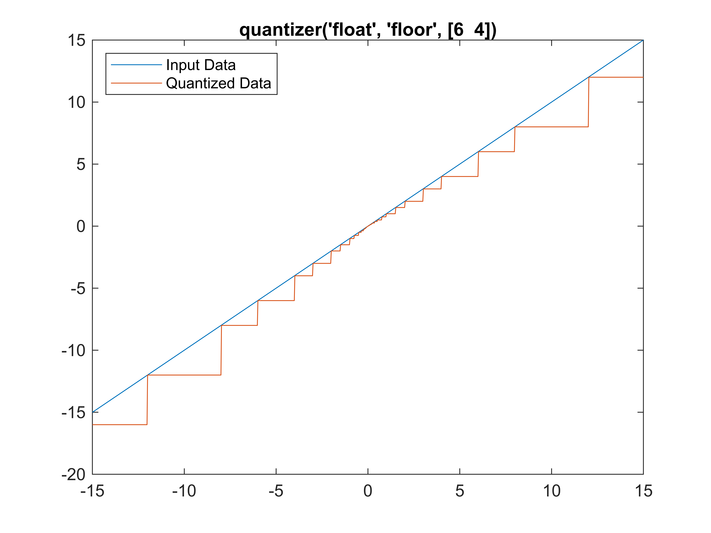
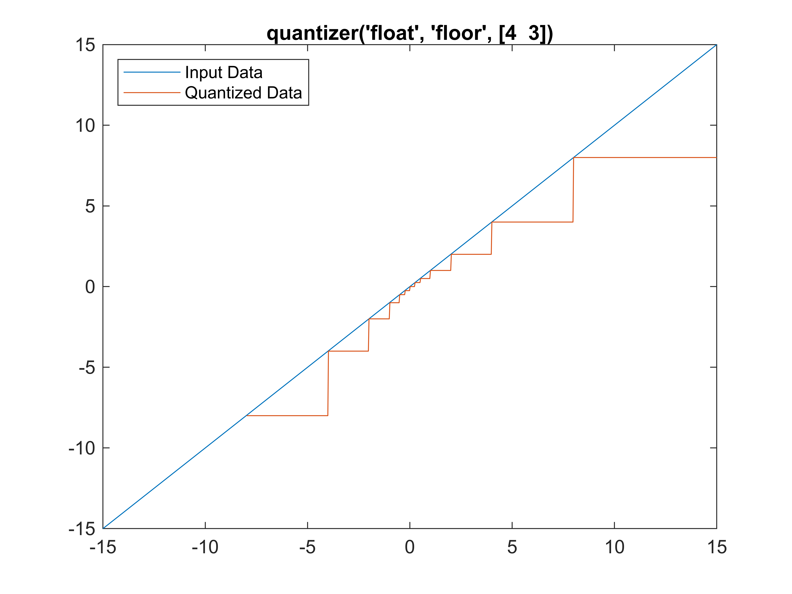
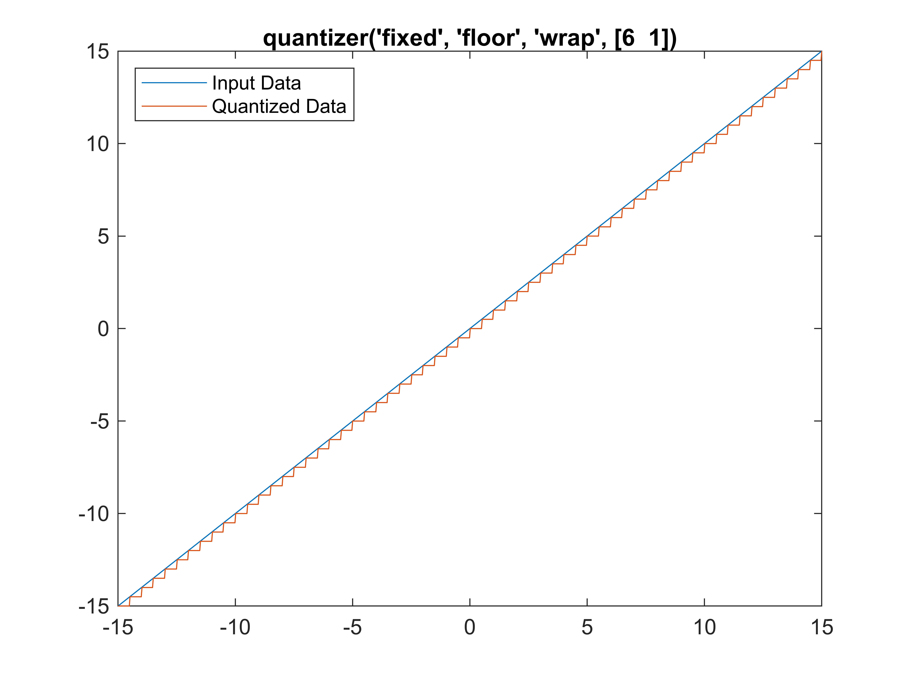

# Quantize Data to Embedded Efficient Floating Point Types

Recent advancement in AI processing technology put focuses on the introduction of new precision formats designed to significantly enhance training and inference performance in AI models. These microscaling data format aims to dramatically reduce the computational resources required for training and inference, leading to greener and more cost\-effective AI operations.


What are FP6 or FP4? How can we use these new floating\-point types? 


This example shows how to quantize data using these data format. 


First, create some data to quantize.

```matlab
x = linspace(-15,15,1000);
```
# Quantize to Custom\-Precision Floating\-Point, FP6

Create a `quantizer` object specifying a custom\-precision floating\-point data mode with a word length of 6 bits and an exponent length of 4 bits.

```matlab
q = quantizer('DataMode','float','Format',[6 4])
```

```matlabTextOutput
q =

        DataMode = float
       RoundMode = floor
          Format = [6  4]
```

The `RoundMode` property uses the default setting of `'Floor'`.


Use the `quantize` function to quantize the data in `x` using the properties specified by the `quantizer` object.

```matlab
y = quantize(q,x);
```

Plot `y` against `x` to visualize the effect of the specified quantization properties on this data.

```matlab
plot(x,x,x,y); title(tostring(q)); 
legend('Input Data','Quantized Data','Location','northwest');
```



You can use read\-only properties of the  `quantizer` object to access more information.

```matlab
q.noverflows
```

```matlabTextOutput
ans = 0
```

```matlab
q.nunderflows
```

```matlabTextOutput
ans = 0
```

In this example, there were 0 overflows and 0 underflows that occurred in the quantization operation.

# Quantize to FP4 type
```matlab
qFP4 = quantizer('DataMode','float','Format',[4 3])
```

```matlabTextOutput
qFP4 =

        DataMode = float
       RoundMode = floor
          Format = [4  3]
```

Again, use the `quantize` function to quantize the data in `x` using the properties specified by the `quantizer` object.

```matlab
y = quantize(qFP4,x);
```

```matlabTextOutput
Warning: 234 overflow(s) occurred in the fi quantize operation.
```

Plot `y` against `x` to visualize the effect of the specified quantization properties on this data.

```matlab
plot(x,x,x,y); title(tostring(qFP4)); 
legend('Input Data','Quantized Data','Location','northwest');
```



We can find out more on the overflow and underflow behaviors. 

```matlab
qFP4.noverflows
```

```matlabTextOutput
ans = 234
```

```matlab
qFP4.nunderflows
```

```matlabTextOutput
ans = 8
```
# Quantize to Fixed\-Point

Create a `quantizer` object specifying a signed fixed\-point data mode with a word length of 6 bits, a fraction length of 1 bit, and wrap on overflow.

```matlab
qFixed = quantizer([6 1],'wrap')
```

```matlabTextOutput
qFixed =

        DataMode = fixed
       RoundMode = floor
    OverflowMode = wrap
          Format = [6  1]
```

`quantizer` uses the default `DataMode` property, `'fixed'`, and the default `RoundMode` property, `'Floor'`.


Use the `quantize` function to quantize the data in `x` using the properties specified by the `quantizer` object.

```matlab
y = quantize(qFixed,x);
```

Plot `y` against `x` to visualize the effect of the specified quantization properties on this data.

```matlab
plot(x,x,x,y); title(tostring(qFixed)); 
legend('Input Data','Quantized Data','Location','northwest');
```



You can use read\-only properties of the  `quantizer` object to access more information.

```matlab
qFixed.noverflows
```

```matlabTextOutput
ans = 0
```

```matlab
qFixed.nunderflows
```

```matlabTextOutput
ans = 17
```

In this example, there were 0 overflows and 17 underflows that occurred in the quantization operation.


*Copyright 2019 The MathWorks, Inc.*

